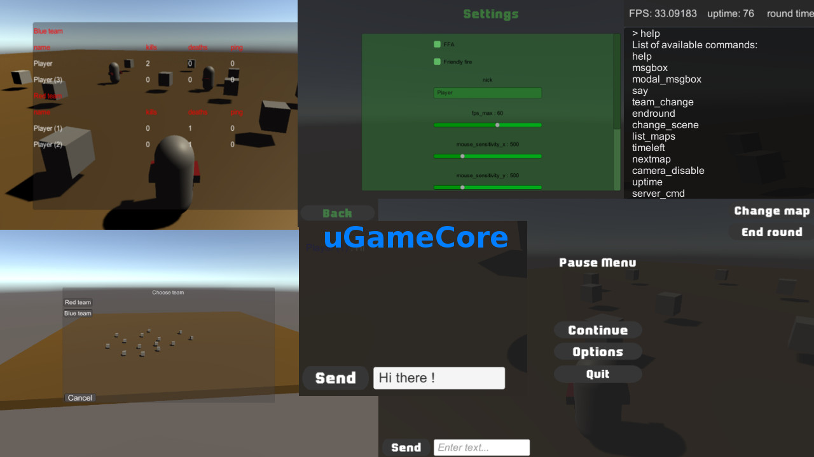

## Overview

uGameCore is a powerful framework for Unity game engine that contains core components of what every game should have. It takes care of everything 'under the hood', allowing you to focus on main parts of the game, like game logic and design. It greatly increases the speed and productivity of development.

Don't ever again start from scratch, or waste your time on creating menus, settings, multiplayer... It is all done for you. You are 10 minutes away from finishing all background stuff, and finally focusing on the game itself.

All features are built on top of Unity, which means it is very easy to extend them, and to adapt them to any existing project.

## Features

- Player management – per player data (e.g nickname), player logins, choosing teams, spawning playing object
- Teams management – every player can belong to a team (select team when joining, or change it later), or be a spectator
- Map cycle – automatic map changing on time interval
- Round system – round ends on time limit or on team victory, causing all players to be respawned
- Spectating other players while dead
- FFA – free for all mode
- Scoreboard
- Chat
- Menu system – hierarchical organization of menus – builtin main menu, start game menu, join  game menu, settings menu, pause menu, ingame menu
- Cvars
- Settings menu – allows to edit configuration (cvars) in a separate menu, and save/load them to playerprefs
- Console – displays game log, allows commands to be entered
- Console commands – can be used for server management, interaction between client and server, etc
- Kill events – UI area for displaying kill events (when one player kills another)
- UI for using all available features
- Batch mode – support for running in batch mode (as a dedicated server)
- Bunch of utility scripts
- Demo scene to get you started
- Extremely easy to extend
- One click setup from editor menu
- many others...

To mention again, the framework is fully extendable. Scripts are communicating using broadcasted messages – new scripts can be added to catch these messages and change behaviour. You can detect almost any event in a game by subscribing to class events.

## Installation

There is an editor menu which allows you to setup the project in one click (located at uGameCore => Setup => One click setup).

So, go ahead and press that menu. If everything went fine (there are no errors or warnings in the console),
then you are good to go => hit the Play button.

If you encounter any errors or warnings during this setup, you should try to fix them.
It's not that difficult, all possible errors and warnings are logged to console, so you can quickly see
what is the problem.

Anyway, these are the steps which performs one-click-setup (which you can perform manually, if the 
setup doesn't work):

- create new scenes as copies of original startup and offline scenes

- add them to build settings

- add demo scenes to build settings

- open newly created startup scene

- create modules (prefabs)

- group modules (you can use menu)

- assign offline scene in NetworkManager

- populate map cycle from build settings

- save scene

## Documentation

Documentation, which explains how things work and contains tutorials, can be found [here](docs/documentation.txt)

## Screenshots

Click [here](screenshots.md) to see screenshots.

## Feedback

If you have any questions, feel free to contact us, or post an issue.

